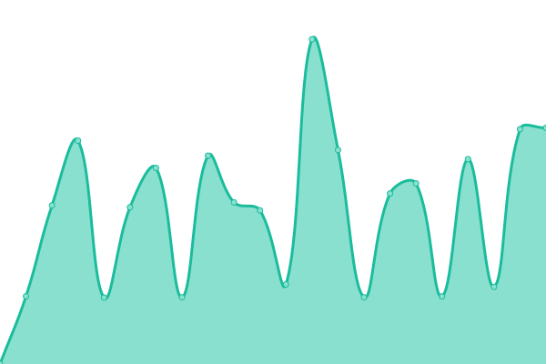

# [📈 Live Status](https://demo.upptime.js.org): <!--live status--> **🟧 Partial outage**

This repository contains the open-source uptime monitor and status page for [Basharat Reyaz ](https://demo.upptime.js.org), powered by [Upptime](https://github.com/upptime/upptime).

With [Upptime](https://upptime.js.org), you can get your own unlimited and free uptime monitor and status page, powered entirely by a GitHub repository. We use [Issues](https://github.com/basharatreyaz/uptimebot/issues) as incident reports, [Actions](https://github.com/basharatreyaz/uptimebot/actions) as uptime monitors, and [Pages](https://demo.upptime.js.org) for the status page.

<!--start: status pages-->
<!-- This summary is generated by Upptime (https://github.com/upptime/upptime) -->
<!-- Do not edit this manually, your changes will be overwritten -->
<!-- prettier-ignore -->
| URL | Status | History | Response Time | Uptime |
| --- | ------ | ------- | ------------- | ------ |
|  [wpsitedoctors](https://www.wpsitedoctors.com/) | 🟥 Down | [wpsitedoctors.yml](https://github.com/basharatreyaz/uptimebot/commits/HEAD/history/wpsitedoctors.yml) | 

 611ms
     
 | 

<a href="https://basharatreyaz.github.io/uptimebot/history/wpsitedoctors">47.94%</a>
    

|  [staging site](https://sitedoctors-in.stackstaging.com/wordpress) | 🟩 Up | [staging-site.yml](https://github.com/basharatreyaz/uptimebot/commits/HEAD/history/staging-site.yml) | 

 1337ms
     
 | 

<a href="https://basharatreyaz.github.io/uptimebot/history/staging-site">99.16%</a>
    

<!--end: status pages-->
